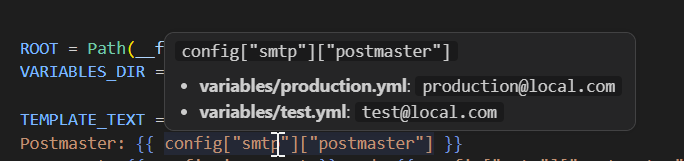

# Jinja Hover Preview

Jinja Hover Preview is a Visual Studio Code extension that previews Jinja `config` variables from YAML variable files. It is designed for template-heavy projects where the same Jinja expression can resolve differently depending on the selected environment file.

The extension is web-compatible and can run in browser-based VS Code environments such as GitLab Web IDE, as well as desktop VS Code.

## Features

- Hover a single Jinja config reference and see its value for each configured YAML file.
- Select a larger text fragment containing multiple Jinja references and preview the fully resolved result for each YAML file.
- Configure one or more variable sources.
- Use individual YAML files or folders containing YAML files as variable sources.
- Enable previewing by VS Code language ID.
- Enable previewing by file name glob patterns.
- Use the side panel for read-only usage guidance and a shortcut to settings.

## Supported Jinja References

This is meant to be a simple extension. This might not be fit to more complex projects importing multiple yml files to different variables.

The extension supports `config` references in dot notation:

```jinja
{{ config.smtp.postmaster }}
{{ config.imap.port }}
```

It also supports bracket notation:

```jinja
{{ config["smtp"]["postmaster"] }}
```

Both forms read from the same YAML object. For example:

```yaml
smtp:
  postmaster: production@local.com

imap:
  port: 2441
```

## Single Value Hover

Given these variable files:

```text
variables/production.yml
variables/test.yml
```

Hovering:

```jinja
{{ config.smtp.postmaster }}
```

will show:



If no value is found for the hovered config path, no hover preview is shown.

## Selected Text Preview

Select text containing one or more Jinja references, then hover inside the selected text.

Example selection:

```jinja
{{ config.imap.port }} and the postmaster is {{ config["smtp"]["postmaster"] }}
```

Example preview:


If any selected reference cannot be resolved for a variable file, that file is skipped for the selected-text preview.

## Settings

Settings are modified only through VS Code settings.

Open settings **(ctrl + shift + p)** and search for:

```text
Jinja Config Hover
```

or edit `settings.json` directly.

### Variable Sources

Use `jinjaConfigHover.variableSources` to define the YAML files or folders to read.

```json
{
  "jinjaConfigHover.variableSources": [
    "variables",
    "environments/production.yml",
    "environments/test.yml"
  ]
}
```

Each source can be:

- a `.yml` file
- a `.yaml` file
- a folder containing `.yml` or `.yaml` files

Relative paths resolve from the workspace folder. `${workspaceFolder}` is also supported:

```json
{
  "jinjaConfigHover.variableSources": [
    "${workspaceFolder}/variables"
  ]
}
```

For web IDEs, workspace-relative paths are recommended.

### Legacy Variables Folder

`jinjaConfigHover.variablesFolder` is kept as a legacy fallback:

```json
{
  "jinjaConfigHover.variablesFolder": "variables"
}
```

Use `jinjaConfigHover.variableSources` for new configuration.

### Enabled Languages

Use `jinjaConfigHover.languages` to control which VS Code language IDs get hover previews:

```json
{
  "jinjaConfigHover.languages": [
    "jinja",
    "python",
    "yaml",
    "json",
    "xml",
    "nginx",
    "haproxy"
  ]
}
```

Default languages include Jinja, plaintext, Python, XML, JSON, YAML, nginx, HAProxy, properties, and common config language IDs.

### File Name Enablement

Use `jinjaConfigHover.filePatterns` to enable previewing by file name glob:

```json
{
  "jinjaConfigHover.filePatterns": [
    "**/*.conf",
    "**/*.properties",
    "**/*nginx*.conf",
    "**/*haproxy*.cfg",
    "**/*haproxy*.conf"
  ]
}
```

This is useful when VS Code assigns a generic or unexpected language ID to a file.

## Side Panel

The extension contributes a **Jinja Hover** icon in the activity bar.

The side panel is read-only and contains:

- how to use the extension
- current variable source configuration
- enabled languages
- enabled file patterns
- a shortcut to open VS Code settings

Settings are not modified from the side panel.

## Web IDE Compatibility

Tested on my gitlab IDE running locally. If gitlab is running behind a reverse proxy, issues may be encountered on allowed origins


## Publishing

Install the packaging tools if needed:

```powershell
npm install -g @vscode/vsce
```

Package:

```powershell
cd extensions
vsce package
```

Install 

```powershell
ode --install-extension .\jinja-config-hover-0.0.1.vsix
```

Publish to the Visual Studio Marketplace:

```powershell
vsce publish
```


## License

MIT
